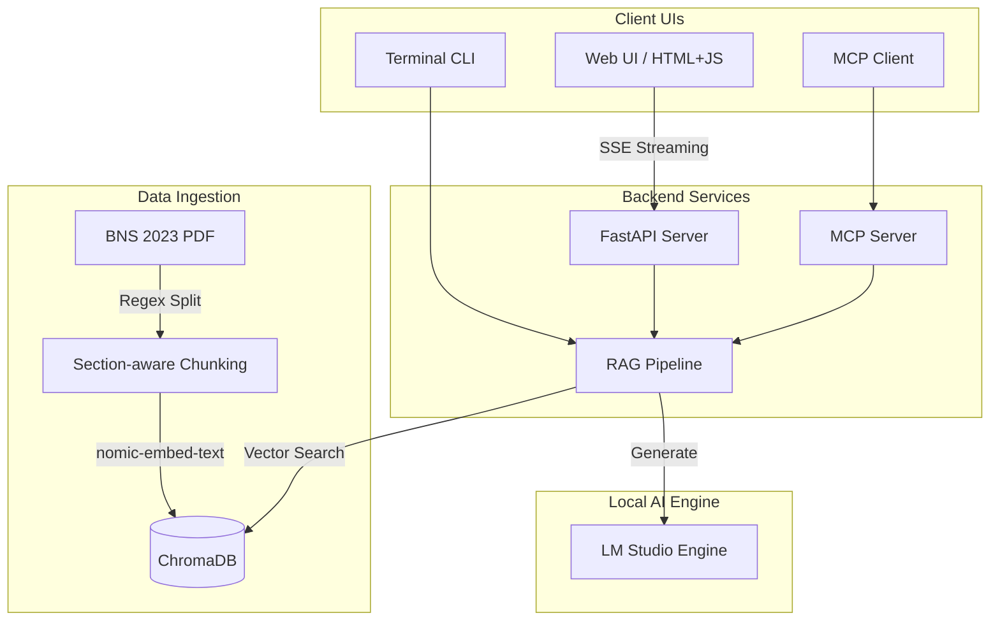

# ⚖️ BNS 2023 RAG Assistant

> **An offline, AI-powered Retrieval-Augmented Generation (RAG) assistant for querying India's Bharatiya Nyaya Sanhita (BNS) 2023 legal code.**

Built with a focus on privacy and precision, this project leverages local Large Language Models (LLMs) via **LM Studio** and **ChromaDB** to provide context-aware, highly accurate answers to legal queries without sending sensitive data to the cloud. It features a modern web UI with a real-time pipeline inspector, a robust FastAPI backend, and smart section-aware document chunking.

---

## 🌟 Features

- **100% Local & Private**: All embeddings and chat inferences run entirely on your local machine using LM Studio. No API costs, no data leaks.
- **Section-Aware Chunking**: Intelligently chunks the BNS 2023 PDF based on actual legal section boundaries rather than arbitrary character counts, ensuring the LLM always receives complete legal context.
- **Multi-turn Conversation State**: Tracks the current topic and gracefully handles pronoun-based follow-up questions (e.g., *"What is the punishment for murder?"* followed by *"Does it apply to minors?"*).
- **Strict Out-of-Scope Rejection**: Enforces similarity thresholds during vector retrieval to firmly decline non-legal or irrelevant queries, preventing AI hallucination.
- **Real-time Pipeline Inspector**: A modern Web UI (inspired by ChatGPT/Claude) that streams not only the LLM's response tokens but also the backend RAG stages (Embedding → Retrieval → Prompt Assembly) via Server-Sent Events (SSE).
- **MCP Server Support**: Exposes the database to MCP clients (like Claude Desktop) via the Model Context Protocol.

---

## 🏗️ System Architecture



### Core Components

1. **`ingest.py`**: The data processor. Reads the PDF, strips noise, splits text using em-dash section boundaries, sub-chunks sections longer than 800 characters with overlap, and ingests them into ChromaDB.
2. **`rag_pipeline.py`**: The brain. Manages the `ConversationState`, builds the retrieval queries, queries ChromaDB, enforces similarity thresholds, constructs the few-shot prompt, and streams LLM output.
3. **`server.py`**: The web backend. A FastAPI app providing a `/chat/stream` endpoint that yields SSE events for UI visualization.
4. **`app.py`**: A fallback interactive command-line interface.
5. **`mcp_server.py`**: A FastMCP implementation exposing the BNS tool to LLM agents.
6. **`static/`**: Vanilla JS/CSS/HTML frontend featuring a dual-pane layout with the chat interface and the pipeline inspector.

---

## 🚀 Getting Started

### 1. Prerequisites

- Python 3.10+
- [LM Studio](https://lmstudio.ai/) installed and running.
- Node.js (only if running the optional ChromaDB UI viewer).

### 2. Environment Setup

Clone the repository and install dependencies:

```bash
git clone <your-repo-url>
cd Group-Project
python -m venv venv
# Windows
venv\Scripts\activate
# Mac/Linux
source venv/bin/activate

pip install -r requirements.txt
```

### 3. LM Studio Configuration

1. Open **LM Studio** and navigate to the **Local Server** tab.
2. Ensure the server is running on port `1234`.
3. Load the following models:
   - **Chat model:** `qwen2.5-0.5b-instruct` (or any equivalent instruct model).
   - **Embedding model:** `text-embedding-nomic-embed-text-v1.5`.

### 4. Ingest the Data

Before running the server, you must process the BNS 2023 PDF and populate the vector database:

```bash
python ingest.py
```
*Note: This will read `data/bns_2023.pdf`, generate embeddings, and store them in the `./chroma_db` directory.*

### 5. Run the Application

Start the FastAPI server:

```bash
uvicorn server:app --reload
```
Navigate to [http://localhost:8000](http://localhost:8000) in your browser to interact with the Web UI.

Alternatively, for a quick terminal session:
```bash
python app.py
```

---

## 🛠️ Advanced Usage

### Running the MCP Server
To allow an MCP client (like Claude) to query your BNS database, you can run the MCP server:
```bash
python mcp_server.py
```

### Viewing the ChromaDB (Optional)
If you wish to visually inspect the vector embeddings, you can use the embedded ChromaDB UI. 

In Terminal 1 (Start Chroma backend):
```bash
chroma run --path chroma_db --port 8000
```
In Terminal 2 (Start UI):
```bash
cd chromadb-ui
npm install
npm run dev
```

---

## 🛡️ License & Disclaimer

This project is intended for educational and research purposes. Do not use the AI-generated outputs as formal legal advice. Always consult the official bare act or a qualified legal professional for matters pertaining to the Bharatiya Nyaya Sanhita, 2023.
