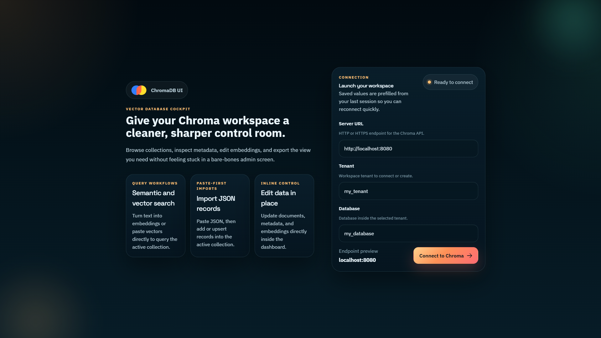
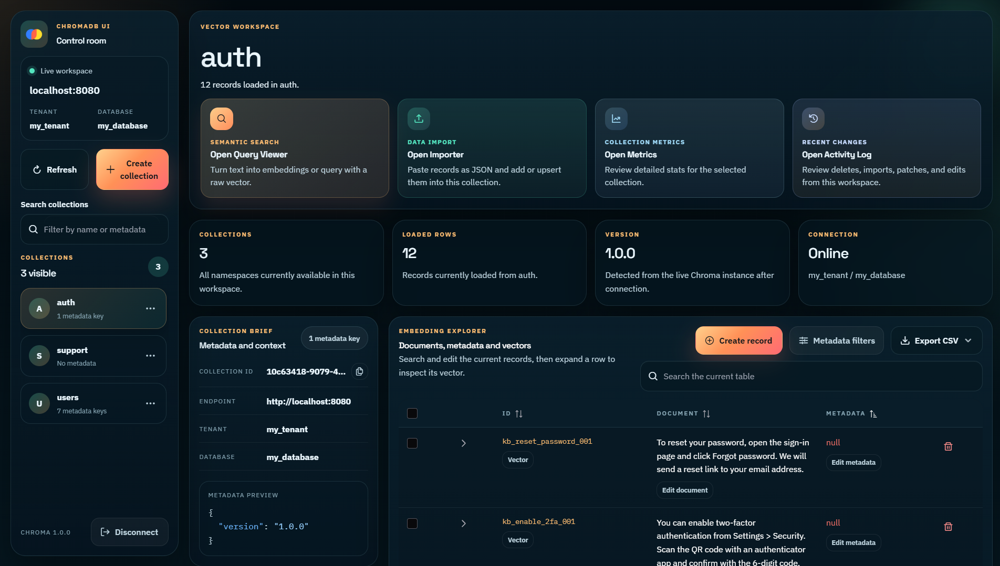
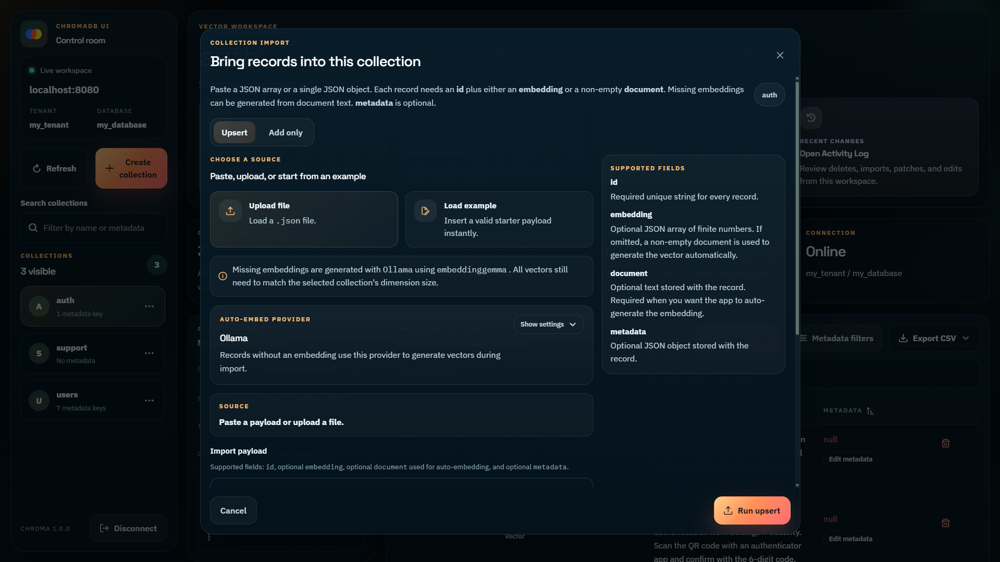
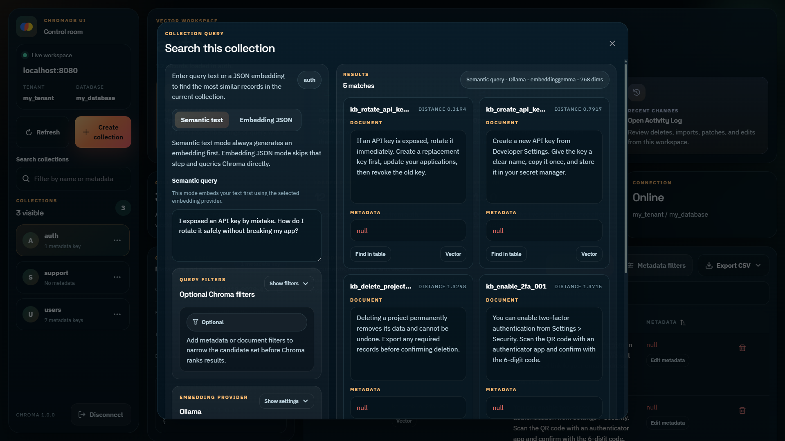
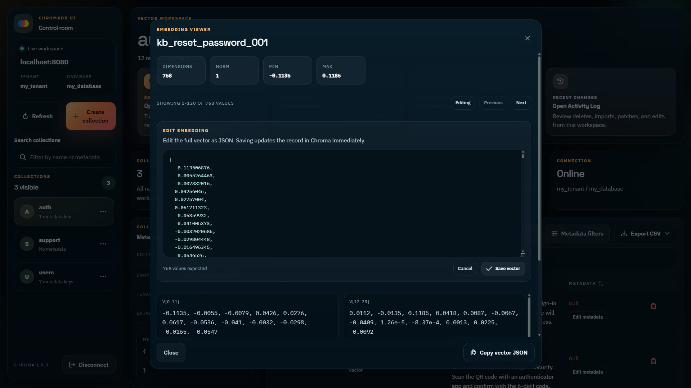

# ChromaDB UI

ChromaDB UI is a web app for exploring and managing a ChromaDB instance through a visual interface instead of raw API calls.

> [!IMPORTANT]  
> **ChromaDB UI only works with the Chroma v2 API**

## Showcase

<p align="center">
  
  
</p>

<p align="center">
  
  
  
</p>

## Demo

You can try the deployed UI [here](https://blackydrum.github.io/chromadb-ui/):

## What You Can Do In The UI

- Connect to a ChromaDB server with a URL, tenant, and database.
- Browse all collections in the current workspace.
- Create, rename, clone and delete collections.
- Inspect and edit collection metadata.
- Run semantic text search inside a collection.
- Choose an embedding provider for semantic queries, including OpenAI or Ollama.
- Run embedding-based nearest-neighbor search with raw vector JSON.
- Search records in the current collection.
- Build metadata filters for the current table view.
- Select multiple rows and run bulk actions like delete, metadata patch, and selected-row CSV export.
- Add records with IDs, documents and metadata, then either paste embeddings manually or auto-generate them from document text.
- Import or upsert JSON records with explicit embeddings or auto-generate missing embeddings from document text.
- Collection metrics viewer with document, metadata, sampled embedding stats, and quality audit findings.
- Review a recent activity log inside the current workspace.
- Edit documents, metadata, and embeddings.
- Open a full vector viewer for large embeddings.
- Export the current table view as CSV.

## Getting Started

You can use ChromaDB UI in three ways:

- Run it locally with `npm run dev`.
- Run the app in a Docker container with Docker Compose.
- Try it out on the [deployed GitHub page](https://blackydrum.github.io/chromadb-ui/).

Follow these steps if you want the local Vite workflow.

1. Clone the repository.

```sh
git clone https://github.com/BlackyDrum/chromadb-ui.git
```

2. Install dependencies.

```sh
npm ci
```

3. Start the development server.

```sh
npm run dev
```

The app runs on `http://localhost:8090` by default.

## Run With Docker Compose

This repository includes a `docker-compose.yml` file, so you can start only ChromaDB, only the UI container, or both together.

1. Ensure Docker is installed and running on your machine.
2. Use the command that matches the workflow you want.

Only ChromaDB:

```sh
docker compose up -d chromadb
```

Only the UI container:

```sh
docker compose up -d --build chromadb-ui
```

ChromaDB and the UI together:

```sh
docker compose up -d --build
```

The UI container serves the production build at `http://localhost:8090`.

## Troubleshooting CORS Issues

If you encounter CORS errors while running the application, you'll need to ensure that the Chroma backend allows requests from the correct frontend origin.

### Update `config.yaml`

```yml
persist_path: "/data"
cors_allow_origins: [
    "http://localhost:8090", # For local development
    "https://blackydrum.github.io", # For the deployed GitHub Pages app
  ]
```

After making these changes, restart the containers or local dev server.

If you are using the deployed GitHub Pages app and want to use Ollama for record creation or semantic query search, you need to add an environment variable for Ollama:

```sh
OLLAMA_ORIGINS=https://blackydrum.github.io
```

After making these changes, restart Ollama.
